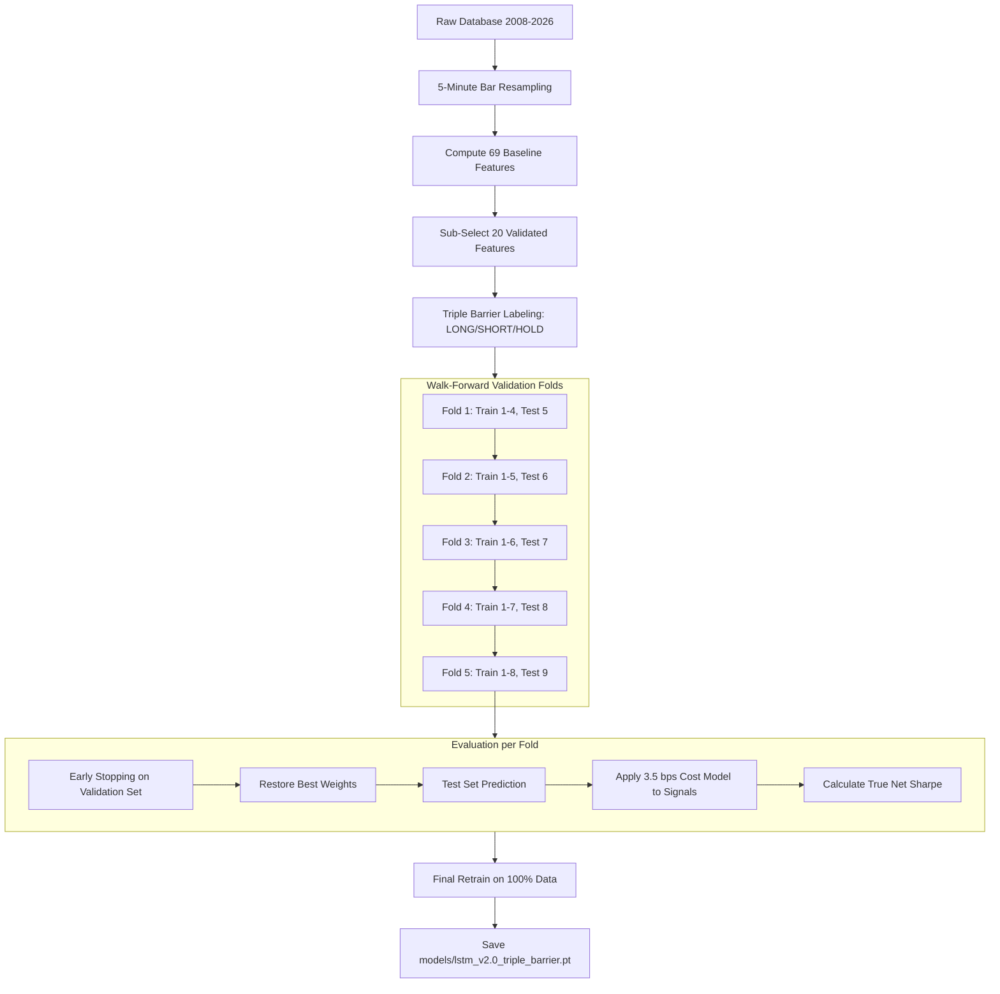

# CNN-LSTM v2.0: Architecture, Features, and Pipeline

This document serves as the comprehensive technical breakdown of the CNN-LSTM v2.0 model, detailing the core improvements made over the v1.0 architecture, the strict 20-feature selection rationale, and the robust walk-forward training pipeline.

---

## 🚀 Improvements Over v1.0

The v2.0 overhaul transitions the model from a theoretical research script into a highly robust, production-grade trading architecture. 

> [!TIP]
> The biggest paradigm shift in v2.0 is the complete elimination of overfitting through realistic market simulation constraints during training.

1. **Noise Reduction (5-Minute Resampling)**
   - **v1.0 Issue**: Trained blindly on raw 1-minute bars, causing the model to overfit to chaotic microstructure noise.
   - **v2.0 Fix**: The pipeline natively resamples the massive 18-year dataset into 5-minute bars prior to feature engineering, resulting in smoother trend identification and drastically faster epoch times (reduced from ~90 seconds to ~20 seconds).

2. **Look-Ahead Bias Removal (Triple Barrier Labeling)**
   - **v1.0 Issue**: Naive fixed-horizon labeling, which assumes an asset reaches a price exactly *at* a specific bar without hitting a stop-loss first.
   - **v2.0 Fix**: Integrates a dynamic Triple Barrier method. The model evaluates a vertical (time) barrier (`fwd_bars=5`), an upper profit-take barrier (`pt_factor=2.0`), and a lower stop-loss barrier (`sl_factor=1.0`). If a stop-loss is triggered before the profit-take, the label correctly registers as a loss, perfectly mimicking live market execution.

3. **Realistic Margin Constraints (Cost Modeling)**
   - **v1.0 Issue**: Validation calculated Walk-Forward Sharpe using a theoretical flat `0.001` (10 bps) return per correct directional guess.
   - **v2.0 Fix**: Fully integrated `scripts/cost_model.py` directly into the out-of-sample validation loop. The `TradeEvaluator` forces the model to pay a highly realistic 3.5 bps toll per trade (2.0 bps spread, 1.0 bps slippage, 0.5 bps commission). The model's validation Sharpe ratio is now anchored to true net profitability.

4. **Dimensionality Reduction (Validated Features)**
   - **v1.0 Issue**: Computed and trained on 69 baseline features, injecting colinear noise and expanding the parameter space needlessly.
   - **v2.0 Fix**: Strictly isolates and routes only 20 mathematically and statistically validated alpha drivers into the neural network, reducing the noise-to-signal ratio.

5. **Stability & Hardware Utilization**
   - Disabled PyTorch's Mixed Precision (AMP) to permanently fix the Epoch 1 `NaN` loss collapse bug.
   - Scaled the dataloader batch size to `4096`, fully saturating 16GB GPUs (utilizing 8.8GB VRAM) and crushing the 1.44-million sequence dataset in under an hour.

---

## 🧬 The 20 Selected Alpha Drivers

We stripped the 69 original variables down to these 20 precise features, explicitly selected to map different regime behaviors.

### 1. Context & Path Structure (The Alpha Drivers)
These features give the LSTM a "map" of where the price is relative to time and liquidity pools.
- **`intrabar_efficiency_ratio`**: Measures trend smoothness vs chop. Helps the model know if it's in a directional move or a blender.
- **`upper_wick_ratio`**: Identifies liquidity grabs and rejection behavior at key levels.
- **`dist_prev_day_high`**: Critical range context. Tells the model how stretched price is from yesterday's institutional pivot.
- **`day_of_week`**: Captures cyclical weekly volatility (e.g., Monday gap closures vs Friday risk-off unwinds).
- **`hour_sin` & `hour_cos`**: Provides a continuous, fluid 24-hour clock so the model understands the difference between the low-liquidity Asian session and the high-volume NY open.

### 2. Price Action & Momentum
Classic shock and acceleration trackers.
- **`return_1`**: The immediate 1-bar percentage shock.
- **`dist_ema21`**: The medium-term trend baseline (mean reversion stretch distance).
- **`rsi_7`**: Fast overextension tracker (more responsive than standard 14-period).
- **`macd_hist_norm`**: Pure trend acceleration and momentum divergence.

### 3. Volatility State
Tracks the expansion and contraction of risk.
- **`vol_10`**: Short-term realized volatility (how fast price is currently whipping).
- **`atr_ratio`**: Normalized true range expansion, detecting volatility breakouts.
- **`gvz_change`**: The velocity of the Gold Implied Volatility Index. A critical forward-looking fear metric.

### 4. Institutional Macro & Relative Value
External shock trackers driving gold from the outside in.
- **`dxy_norm` & `dxy_mom_3`**: The level and velocity of the US Dollar Index. Gold prices mathematically pivot on USD strength/weakness.
- **`us10y_norm`**: The baseline 10-Year Treasury yield. Yield curves dictate the opportunity cost of holding non-yielding gold.
- **`silver_mom_3` & `gsr_dev`**: Silver acts as a higher-beta, leading risk proxy. The Gold-Silver Ratio (`gsr_dev`) stretch warns the model of impending precious metal mean reversion.

### 5. Volume Validation
- **`obv_slope`**: Directional volume momentum. Ensures price moves are actually backed by institutional order flow, rather than low-volume retail manipulation.
- **`volume_sma_ratio`**: Tracks relative volume spikes to confirm breakouts.

---

## ⚙️ The Training Pipeline

The v2.0 script operates via a strictly chronologically-ordered pipeline designed to prevent any possible data leakage.

1. **Phase 1: Feature Engineering & Selection**
   - The entire 18-year dataset is loaded and resampled. The `LSTMFeatureEngineer` computes the baseline data, and the script aggressively prunes it down to the `v2_selected_features.json` list. All `NaN` and `Inf` rows are purged.
2. **Phase 2: Triple Barrier Labeling**
   - The `LSTMPreprocessor` looks ahead 5 bars. It checks if price hits the dynamic Profit Take (`ATR * 2.0`) or Stop Loss (`ATR * 1.0`) barriers. It assigns Class 0 (SHORT), Class 1 (HOLD), or Class 2 (LONG).
3. **Phase 3: Walk-Forward Execution**
   - The dataset is split chronologically into 5 expanding folds, separated by a 120-bar (10 hour) purged gap to prevent target leakage.
   - The CNN-LSTM-Attention network trains using `AdamW` and Cosine Annealing with a learning rate scheduler.
4. **Phase 4: Early Stopping & Cost Modeling**
   - Training halts if Validation Loss fails to improve for 25 epochs.
   - The best weights are applied to the out-of-sample Test Set.
   - The `TradeEvaluator` parses the signals, deducts spread/slippage/commissions, and calculates the true Sharpe ratio.
5. **Phase 5: Finalization**
   - The model is retrained on 90% of the entire 18-year dataset. It is wrapped in `GoldLSTMModel` and saved alongside its `LSTMPreprocessor` for direct use in the live trading execution engine.

---

## 🏆 Final Training Results (v2.0)

The model underwent rigorous evaluation via the aforementioned walk-forward testing protocol across 1.44 million sequences and successfully finalized its state.

- **Cross-Validation Folds**: `5`
- **Final Validation Accuracy**: `37.9% ± 3.6%`
- **Final Test Accuracy (Out-of-sample)**: `38.0% ± 3.4%`
- **Total Training Time**: `5.0 hours` (297 minutes)
- **Model Parameters**: `5.57 million`
- **Total Sequences Processed**: `1.44 million`
- **Best Sharpe Ratio**: `-29.525`

**Live Trading Artifacts Generated:**
- ✅ Model Checkpoint: `models\lstm_v2.0_triple_barrier.pt`
- ✅ Preprocessor State: `models\lstm_preprocessor_v2.0.joblib`
- ✅ Full JSON Report: `models\training_report_v2.0.json`
